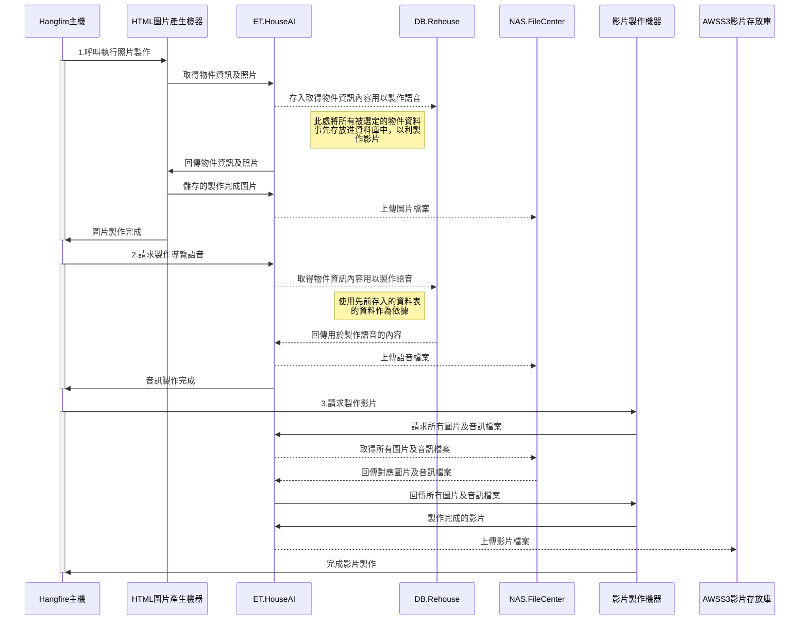

# Sequence-Diagram
使用VSCode產出循序圖所需套件(Extensions)及範例代碼

## 安裝所需套件
- Markdown Preview Enhanced (必)
- One Dark Pro
- Markdown All in One
- Markdownlint
- Mermaid Markdown Syntax Highlighting SQL 擴展套件

範例
```

```


